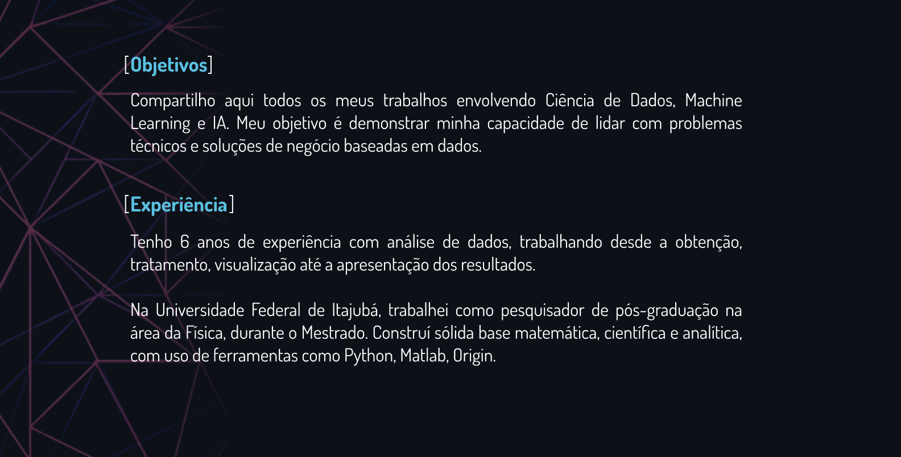
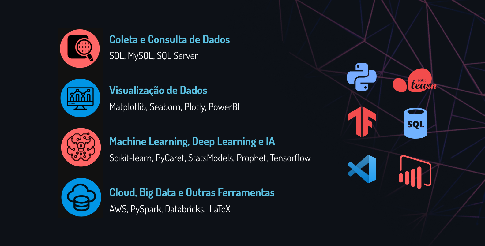
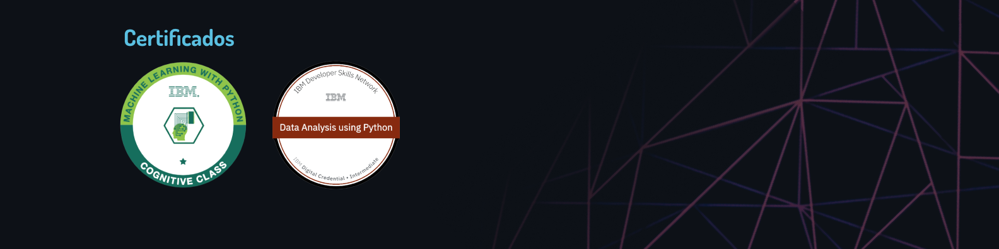

  

  

  

  

# Projetos

Meu portfólio de Ciência de Dados e Machine Learning contém projetos que envolvem análise exploratória de dados, visualização de dados, modelagem com aprendizado supervisionado, não-supervisionado. Além disso, possui projetos relacionados a séries temporais e automação voltados para aplicações em problemas de negócio, como _Churn_, detecção de fraudes, previsão de vendas e preços, entre outros.

> [**Clique aqui para acessar meu portfólio de projetos em Data Science.**](https://github.com/gabrielrflopes/Data-Science-Portfolio)

## Redes Sociais e Contato

 
 
 

> **E-mail**: **gabriel.rfl@hotmail.com**
